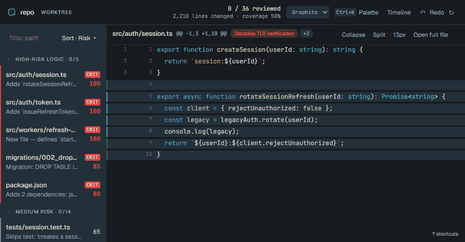

# Sift

Review AI-generated code without drowning.



Sift is a local-first review cockpit for large AI-generated diffs. Run it inside a git repository and it turns the diff into an ordered queue: risky logic first, skim-safe bulk at the end, and review status preserved in `.sift/`.

## The Problem

AI agents can produce more code than a human can calmly review in one pass. Existing dashboards usually monitor sessions and cost, while reviewer bots add another model opinion. Sift focuses on the human review bottleneck: deterministic triage, visible reasons, and durable state.

## Quickstart

```bash
pnpm i
pnpm build
pnpm sift
```

Until packages are published, run the built binary directly with:

```bash
node packages/cli/dist/index.js
```

For a reproducible demo repo:

```bash
pnpm demo
```

## What It Does

- Triage: classifies hunks as logic, tests, config, deps, docs, mechanical, generated, or binary.
- Risk: scores hunks with deterministic rules and inspectable evidence.
- Provenance: reads local Claude Code hook logs and transcripts when available.
- Debt: tracks how much reviewable changed code has actually been approved or flagged.

## Commands

| Command | Purpose |
|---|---|
| `sift [range]` | Analyze the worktree or a ref/range, start the local UI, and print the URL. |
| `sift --staged` | Analyze staged changes. |
| `sift pr <number-or-url>` | Analyze a GitHub PR diff through the `gh` CLI. |
| `sift report [--md\|--json] [-o file]` | Emit a markdown or JSON review report and append a stats snapshot. |
| `sift print [--json]` | Print a compact terminal triage summary without starting the server. |
| `sift stats [--json]` | Print current debt, reviewed percentage, flags, and provenance coverage. |
| `sift check [--max-debt pct]` | Exit non-zero if debt is too high or any hunk is flagged. |
| `sift demo [--dir path]` | Generate the demo repo and launch Sift against it. |
| `sift rules lint` | Validate global and repo rules files. |
| `sift rules list` | Print the effective merged ruleset. |
| `sift mcp` | Serve read-only review context over stdio MCP tools. |
| `sift hooks install [--project]` | Install the Claude Code PostToolUse capture hook. |
| `sift hooks status [--project]` | Show whether the hook is installed. |
| `sift hooks uninstall [--project]` | Remove only Sift's hook entry. |

## Cockpit Keys

| Key | Action |
|---|---|
| `Ctrl/Cmd+K` | Open the command palette. |
| `j` / `k` | Next / previous visible hunk. |
| `n` / `p` | Next / previous unreviewed attention hunk. |
| `J` / `K` | Next / previous file. |
| `a`, `x`, `u` | Approve, flag, or mark unreviewed. |
| `i` | Focus the note field. |
| `space` | Collapse or expand the current hunk body. |
| `s` | Cycle risk, reading, and path sort modes. |
| `t` | Open the provenance timeline. |
| `T` | Toggle light/dark theme. |
| `?` | Open help. |

## Claude Code Hooks

`sift hooks install` merges a PostToolUse hook into Claude Code settings. The hook runs `sift hook-capture` after Edit, Write, and MultiEdit tools and appends compact hashes plus session metadata to `~/.sift/provenance.jsonl`.

Captured data stays on disk. Sift records session id, transcript path, cwd, tool name, edited file path, hashes of added lines, and line count. It does not send this data anywhere.

Use `--project` to write `.claude/settings.json` in the current repo instead of user-level Claude settings.

## Optional AI

`--ai`, `--ai=anthropic`, or `--ai=openai` adds annotation-only summaries for high and medium risk hunks. This is strictly opt-in. Hunks with `SECRET_LIKE` are excluded from provider requests, and AI output never changes score, category, order, or status.

## Security And Privacy

- Runtime is offline-first by default.
- No telemetry or analytics.
- Git access is read-only.
- The web server binds `127.0.0.1` only and has no auth because it is single-user loopback software.
- State lives under `.sift/`, which self-ignores with `.sift/.gitignore`.

## Roadmap

- AST/tree-sitter structural diffing
- GitHub PR commenting / GitHub App
- Watch mode
- Cursor and Codex CLI provenance adapters
- MCP server exposing review state
- Test-impact analysis
- Stacked-diff awareness
- Team/server mode
- Plugin API
- i18n
- Windows CI

## Contributing

See [CONTRIBUTING.md](CONTRIBUTING.md).

## License

MIT.
