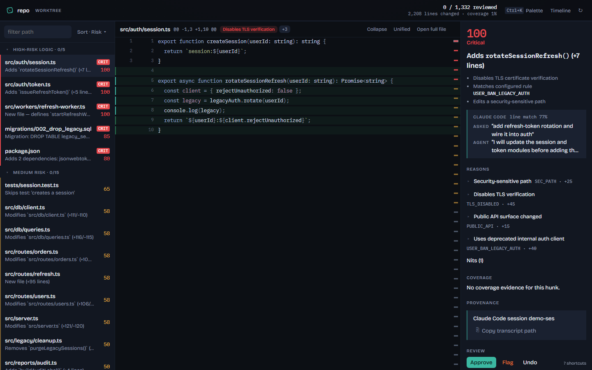
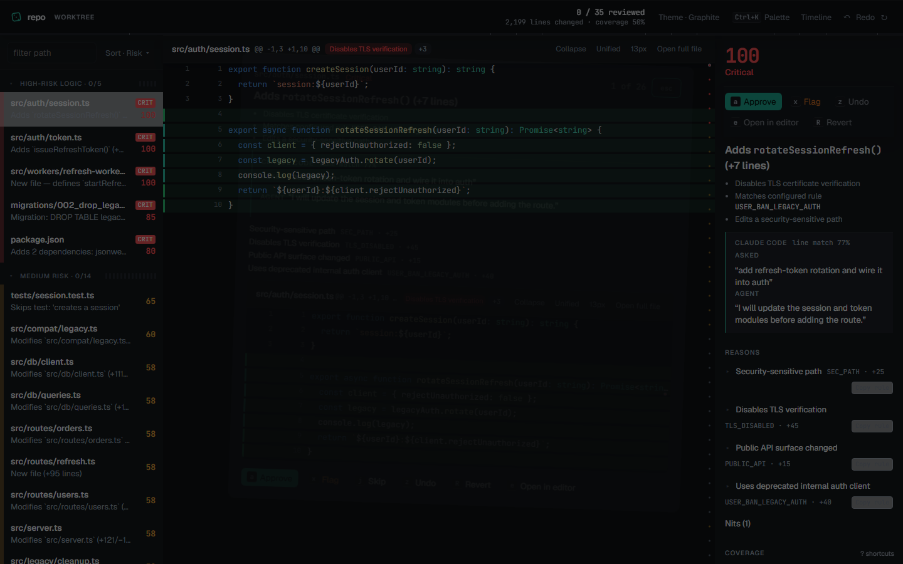
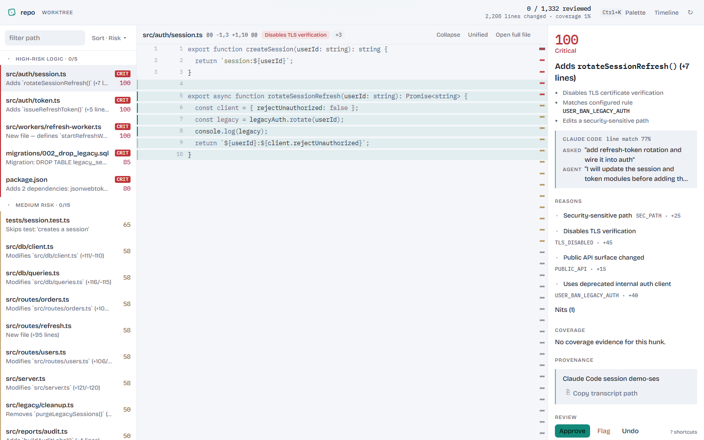
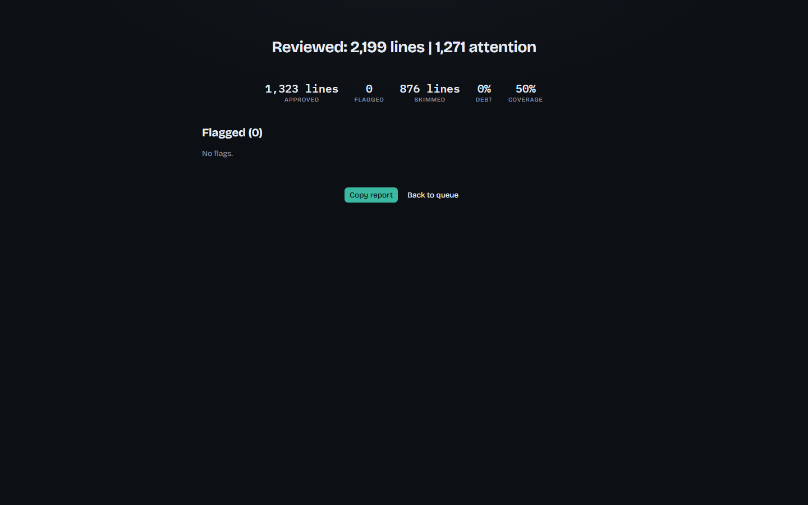
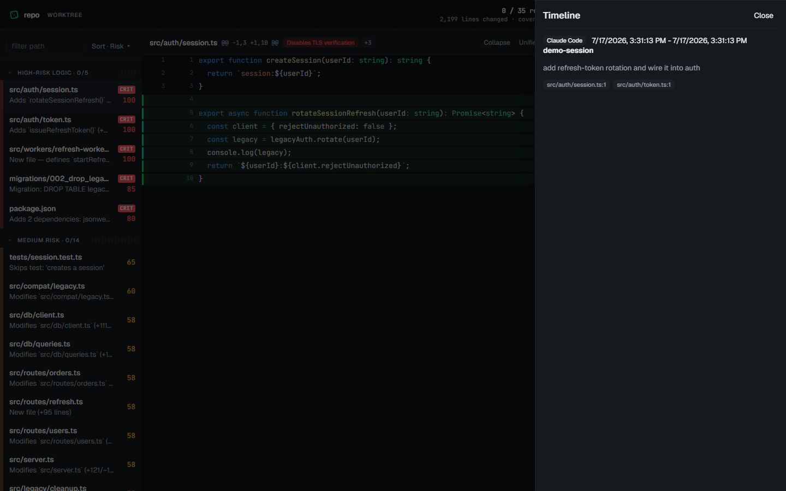
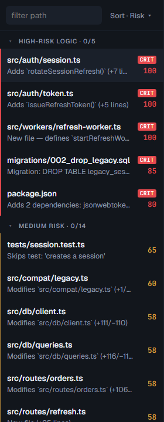
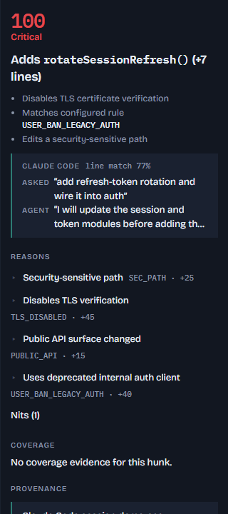

# Sift

**Stop reading slop. Verify what matters—while the diff is still moving.**

Sift is a local-first review cockpit for large AI-generated diffs. It turns a repository diff into an ordered queue: critical logic first, skim-safe mechanical bundles last, visible evidence on every risky hunk, and durable local review state. In live mode, the queue updates alongside an agent's work without deciding anything for you.



## Why

AI agents can produce more code than a human can calmly review in one pass. Sift focuses on the human bottleneck: deterministic triage, structure, coverage evidence, provenance, and durable local decisions. Optional AI annotations can summarize, but never change score, category, order, grouping, or status.

## Quickstart

macOS/Linux:

```bash
pnpm i
pnpm build
pnpm sift
```

Windows PowerShell:

```powershell
Set-Location C:\path\to\sift
pnpm i
pnpm build
pnpm sift
```

Until packages are published, run the built binary directly:

```bash
node packages/cli/dist/index.js
```

Try the demo with `pnpm demo`, or run `node packages/cli/dist/index.js demo` after building.

## Screenshots

| Workbench | Focus mode |
|---|---|
|  |  |

| Light workbench | Completion | Timeline |
|---|---|---|
|  |  |  |

| Queue close-up | Inspector close-up |
|---|---|
|  |  |

Regenerate the complete set with `pnpm shots`.

## Live mode and the fix loop

Start a local review companion for the working tree, or for Git's index:

```bash
sift --watch
# or
sift --staged --watch
```

Sift watches changes, re-runs the same review after a short debounce, and streams hunk deltas into the open browser. Existing decisions never change. A modified hunk gets a new ID and returns unreviewed, marked **fresh**; untouched approvals remain approved. The `New (n)` header button filters fresh hunks, and opening or deciding one clears its fresh marker.

```text
flag in Sift → sift brief | clip (or MCP) → agent fixes → fresh hunks return in watch mode
```

Use `sift brief` for flagged hunks, or `sift brief --unreviewed-high` for unreviewed high-risk work. It includes the reviewer note, primary reasons, and a patch capped at 120 lines per hunk.

## What it does

- **Digest:** factual, deterministic headlines and details for every hunk.
- **Triage:** logic, tests, config, dependencies, docs, mechanical, generated, and binary categories.
- **Risk:** inspectable deterministic reasons plus optional user rules.
- **Structure:** formatting detection, rename-pattern groups, definitions, references, and reading-order hints.
- **Coverage:** LCOV and Cobertura artifacts that you generated yourself.
- **Provenance:** Claude Code hook logs and compatible open JSONL records.
- **State:** approved, flagged, and unreviewed decisions stored locally under `.sift/`.

## Commands

| Command | Purpose |
|---|---|
| `sift [range]` | Analyze the worktree or a ref/range and start the loopback UI. |
| `sift --staged` | Analyze staged changes. |
| `sift --watch` | Keep the default worktree review live; it also works with `--staged`, not a ref range or PR. |
| `sift pr <number-or-url>` | Analyze a GitHub PR diff through `gh`. |
| `sift brief [--flagged\|--unreviewed-high] [-o file]` | Produce an agent-ready review handoff. |
| `sift report [--md\|--json] [-o file]` | Emit a report and append a stats snapshot. |
| `sift print [--json]` | Print compact terminal triage without starting the server. |
| `sift stats [--json]` | Print review debt, progress, flags, and line-match coverage. |
| `sift check [--max-debt pct]` | Personal pre-push aid; not a team performance metric. |
| `sift demo [--dir path]` | Generate the demo repository and launch Sift. |
| `sift rules lint` / `sift rules list` | Validate and display the effective ruleset. |
| `sift mcp` | Serve read-only review context over stdio MCP tools. |
| `sift tui [range]` | Full-screen terminal review cockpit (Ink); same pipeline and `state.json` as the web UI. |
| `sift hooks install [--project]` | Install the Claude Code PostToolUse capture hook. |
| `pnpm shots` / `pnpm perf` / `pnpm pack-check` / `pnpm eval` / `pnpm fuzz` | Reproduce visual evidence, check the pipeline budget, verify an installed tarball, run the corpus eval, or property-fuzz the parser/pipeline. |

## Terminal cockpit (`sift tui`)

Browser-averse path that shares the decision-core, digests, and `.sift/state.json` with the web UI.

```text
SIFT TUI FRAME · 34 hunks · 11 groups · debt 100%
[attention] High-risk logic (5)
[attention] Medium risk (15)
…
-- src/auth/session.ts · high 100 · Adds `rotateSessionRefresh()` (+7 lines)
footer: n of m · j/k move · a approve · x flag · u unreview · z undo · q quit
```

Keys: `j`/`k` hunk · `g`/`G` first/last · `n`/`p` next/prev unreviewed attention · `a` approve · `x` flag (1–4 quick reasons, `i` note) · `u` unreview · `z` undo · `A` group · `space` expand patch · `o` editor · `?` help · `q` quit (prints `sift print` summary). Prefer a terminal ≥100×28; 80×24 still works with truncation. Use `--watch` for live refreshes and `--print-frame` for CI smoke.

## Cockpit keys

| Key | Action |
|---|---|
| `Ctrl/Cmd+K` | Open the command palette. |
| `j` / `k`, `J` / `K` | Move by hunk, or by file. |
| `n` / `p` | Next / previous unreviewed attention hunk. |
| `a`, `x`, `u`, `z` | Approve, flag, unreview, or undo the last decision. |
| `f` | Enter/exit focus mode. |
| `e` | Open the current hunk at its first changed line in the configured editor. |
| `i`, `space`, `s` | Focus note, collapse hunk, or cycle sort order. |
| `t`, `T`, `?` | Open timeline, toggle theme, or open help. |

In focus mode the action row is `[a] Approve` `[x] Flag` `[j] Skip` `[z] Undo` `[e] Open in editor`; `Esc` returns to the workbench. The **New (n)** header button filters fresh hunks.

## Change digests and the summary stack

Every hunk carries a factual digest computed deterministically in core. Understanding arrives in a labeled stack:

- **auto**: deterministic digest (headline and details), always present.
- **agent**: when provenance matches, the Intent block shows what was asked and the agent reasoning excerpt.
- **AI**: with `--ai`, an optional second headline line labeled `AI · <provider>`.

Sift **describes, never judges**. It informs the decision; you make it.

### Flag reasons and editor jump

Quick-flag reasons default to `Needs tests`, `Security concern`, `Doesn't match intent`, and `Unnecessary change`. Override them in `.sift/config.json`:

```json
{ "flagReasons": ["Needs tests", "Perf risk", "Out of scope"] }
```

Set a known editor ID or a safe argument template in that same file:

```json
{ "editor": "code" }
```

```json
{ "editor": "subl %f:%l" }
```

Sift resolves the selected hunk server-side and launches only the configured editor (or detected `code`/`cursor`) through `execFile` with an argument array. It never opens a shell or executes anything from the reviewed repository.

## Rules, coverage, provenance, and MCP

Rules load from `~/.sift/rules.yml` and then `<repo>/.sift/rules.yml`, with repo rules winning. See [docs/RULES.md](docs/RULES.md).

Sift never executes repository tests, scripts, or configs. It only parses LCOV and Cobertura artifacts you already produced; pass `--coverage <path>` when autodetection is not right.

`sift hooks install` merges a Claude Code PostToolUse hook into settings and writes compact provenance metadata to `~/.sift/provenance.jsonl`. On Windows, the default settings file is `%USERPROFILE%\.claude\settings.json`; use `sift hooks install --project` for repo-local settings. See [docs/PROVENANCE.md](docs/PROVENANCE.md).

`sift mcp` runs one review and exposes read-only stdio tools for agents. It has no write tools and accepts only IDs/enums as inputs. See [docs/MCP.md](docs/MCP.md).

## Optional AI

`--ai`, `--ai=cross`, `--ai=same`, `--ai=both`, `--ai=anthropic`, or `--ai=openai` adds annotation-only summaries for high and medium risk hunks. Secret-like hunks are excluded from provider payloads. AI output never changes score, category, order, grouping, or status.

## Security and privacy

- Offline-first by default; no telemetry or analytics.
- Sift never runs reviewed repository code.
- Git access is read-only except the explicit `pr` command's use of `gh`.
- The web server binds `127.0.0.1` only.
- Web and grammar assets are bundled from disk; nothing is fetched at runtime.
- Network is limited to localhost and explicit `--ai` provider calls.

## Help

See [docs/TROUBLESHOOTING.md](docs/TROUBLESHOOTING.md) for command-first fixes for Git, `gh`, coverage, ports, watch mode, editors, Windows PATH, and bundled assets.

## License

MIT.
